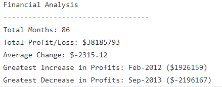

# Bank and Election Data Analysis with Python
* PyBank:- Python script for analyzing the financial records of a company with financial record for 86 months.
* PyPoll:- Analyse results of an election by vote counting using a python script and outputs the results.

## Narrative
* PyBank analyzes and outputs summary of the net total amount of revenue, average change in revenue per month, greatest revenue increase in  a month, and greatest revenue decrease in a month.
* PyPoll counts and outputs total votes earned by each candidate, their respective percentage share and total votes casted.

## Tools and Technologies Used and Required to Run the Project
* Python

## How to Run the Code

1. Save the PyBank and PyPoll folders to your computer.
2. Open your terminal.
3. cd into the folder where you saved the files in.
4. cd into either of the folders and run the command "python main.py"
5. You will be able to see the results. Also, an output csv file will be added to both the PyBank and PyPoll folders with the results

## Output

PyBank Output

PyPoll Output

